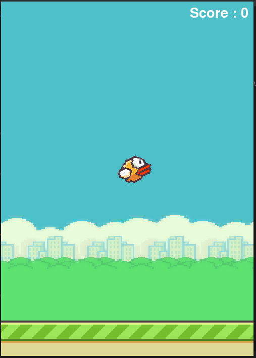
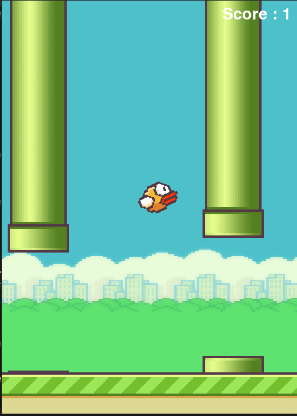
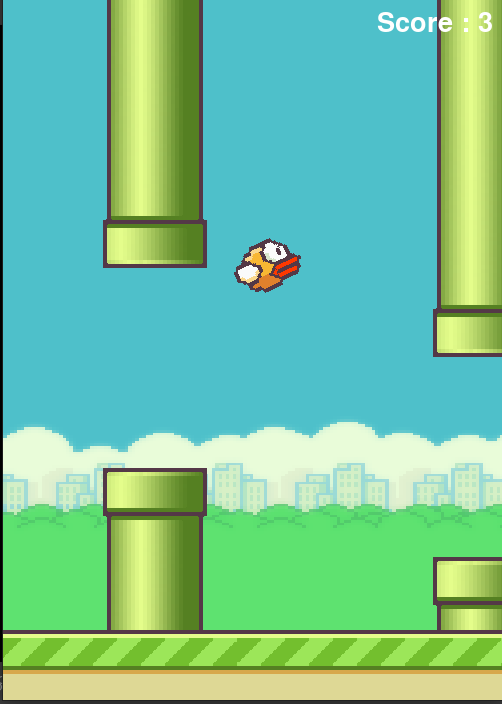
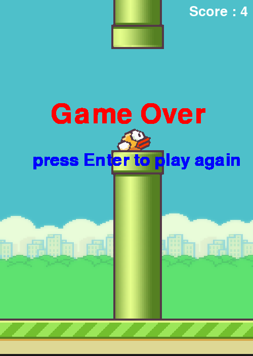

# flappy_bird_using_pygame

## Introduction

##### This game was develop by using pygame library, It is very simple game, In this project I am using Object Orientated Programming(OOP)

![flappy bird][thumbnail]

## Screenshot

[thumbnail]: https://github.com/MdNaina/flappy_bird_using_pygame/blob/main/screenshots/thumbnail.png "flappy bird"
